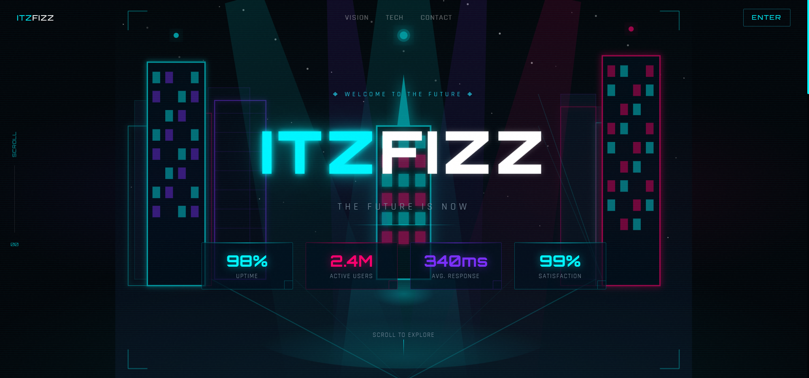

# 🌌 NEON HORIZON — ITZFIZZ Scroll Animation

A **scroll-driven hero section animation** built as part of an internship assignment, showcasing smooth motion, immersive UI, and high-performance frontend animation.

---

## 🌐 Live Demo & Repository

🔗 Live Website: https://tanyavaish-17.github.io/ITZFIZZ-Neon-Horizon/  

💻 GitHub Repo: https://github.com/TanyaVaish-17/ITZFIZZ-Neon-Horizon

---

## 🏙️ Project Concept

* **Brand Name:** ITZFIZZ
* **Theme:** Futuristic Neon City
* **Tagline:** *"The Future is Now"*

This project creates a cinematic experience where users **enter a neon city through scroll interaction**, combining motion, depth, and storytelling.

---

## 🖼️ Preview



---

## 🎬 Animation Story (Scroll Journey)

| Stage          | Description                                                           |
| -------------- | --------------------------------------------------------------------- |
| 🚀 **Load**    | Letter-spaced headline fades in (staggered), stats animate one by one |
| 🌆 **0–30%**   | City skyline zooms in, glow & fog intensify                           |
| 🛣️ **30–60%** | Camera flies forward, buildings split left & right                    |
| 🎯 **60–100%** | CTA + stats pin, background gains depth blur                          |

---

## ✨ Features

### 🎯 Core Requirements (Implemented)

* Full-screen hero section (above the fold)
* Letter-spaced animated headline
* Animated stats/metrics section
* Scroll-driven animation tied to user interaction
* Smooth easing and interpolation

### 🌟 Advanced Effects

* 🏙️ SVG Neon City (no image dependency)
* 🎞️ GSAP + ScrollTrigger animation system
* 💡 Glow & light beam effects reacting to scroll
* ✨ Per-letter staggered headline animation
* 🌌 Particle/star layer for depth

---

## ⚡ Performance Optimizations

* Uses **transform (translate, scale)** for smooth animations
* Avoids layout reflows and heavy calculations
* Optimized scroll handling using GSAP

---

## 🛠️ Tech Stack

* ⚛️ Next.js 14 (App Router)
* 🟦 TypeScript
* 🎨 Tailwind CSS
* 🎞️ GSAP + ScrollTrigger
* 🌐 HTML, CSS, JavaScript

---

## 📁 Project Structure

```bash
.
├── app/
│   ├── components/
│   │   ├── HeadlineText.tsx
│   │   ├── HeroSection.tsx
│   │   ├── NeonCity.tsx
│   │   ├── ScrollProgress.tsx
│   │   └── StatsRow.tsx
│   ├── globals.css
│   ├── layout.tsx
│   └── page.tsx
│
├── public/
├── .github/
│   └── workflows/
│       └── deploy.yml
├── next.config.js
├── next.config.mjs
├── tailwind.config.ts
├── tsconfig.json
├── package.json
└── README.md
```

---

## ⚙️ Installation & Setup

```bash
# Install dependencies
npm install

# Run development server
npm run dev

# Build project
npm run build
```

---

## 🚀 Deployment (GitHub Pages)

1. Update `next.config.js`:

```js
basePath: '/your-repo-name'
```

2. Push code to GitHub

3. Enable GitHub Pages:
   Settings → Pages → Deploy from branch

---

## 📌 Assignment Compliance

✔️ Scroll-based animation implemented  
✔️ Smooth initial load animations  
✔️ Responsive hero section  
✔️ Clean and structured code  
✔️ High-performance animation techniques  
✔️ Hosted project

---

## 🌟 Highlights

* 🎬 Cinematic scroll storytelling
* ⚡ Smooth and optimized animations
* 🎨 Modern neon UI design
* 🧠 Well-structured React components
* 🚀 Real-world frontend animation implementation

---

## 👨‍💻 Author

**Tanya Vaish**
B.Tech CSE | Frontend Developer

---

⭐ *If you found this project interesting, consider giving it a star!*

